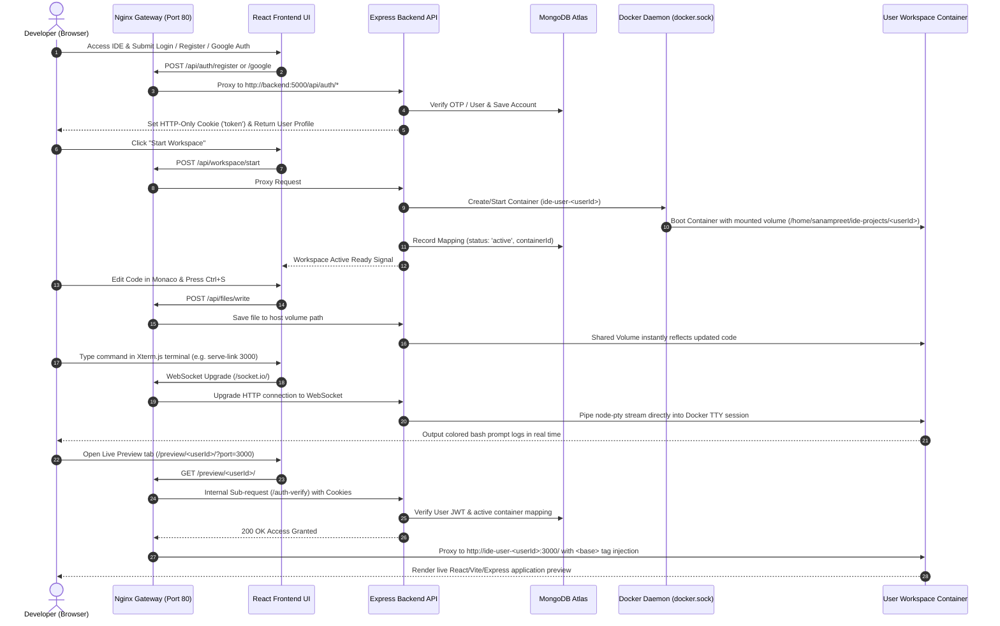

# 🚀 Cloud IDE Capstone: Project Status & Architectural Report

> **Project Name:** Cloud IDE (Terminal-Based Cloud Workspace)  
> **Target Audience:** Capstone Defense & Technical Reviewers  
> **Last Updated:** August 9, 2026  

---

## 🎯 1. Project Goal & Core Objectives

The goal of this project is to build a **Multi-Tenant Cloud-Based Integrated Development Environment (Cloud IDE)** that enables users to write code, execute commands in an isolated cloud terminal, manage files in real time, and instantly preview web applications—all through a browser.

### Key Capstone Architectural Highlights
1. **True Multi-Tenancy & Container Isolation:**  
   Every registered user receives a dedicated, resource-capped Docker workspace container (`ide-workspace:latest` with non-root `codeuser`, C++/Node.js toolchains, and `tini` init process) spawned dynamically by the Express backend.
2. **Zero-Config Dynamic Web Previews:**  
   Nginx reverse proxy uses regex-based routing (`/preview/<user_id>/`) combined with internal `/auth-verify` sub-requests to proxy user web applications (Vite/React/Express) running on any port inside their container directly to the browser with `<base>` tag injection and uncorrupted MIME headers.
3. **Real-time Terminal & Workspace File Sync:**  
   `xterm.js` in the frontend communicates over WebSockets (`Socket.io`) connected to `node-pty` / Docker execution streams inside the backend, while host-mounted volumes (`/home/sanampreet/ide-projects/<userId>`) keep user files persistent and synchronized with Monaco Editor.

---

## 📁 2. Complete Repository File Structure

```text
Online-IDE-Terminal-Based-IDE-/
├── .env                        # Infrastructure environment variables (Ports, JWT Secret, Mongo URI)
├── .gitignore                  # Git ignore rules
├── compose.yml                 # Orchestrates Gateway (Nginx), Backend (Manager), and Frontend static builder
├── setup.sh                    # Automation script for network setup, directory creation & master image build
├── README.md                   # Project documentation
│
├── infra/                      # Reverse Proxy Infrastructure
│   └── nginx.conf              # Nginx configuration template with Zero-Config Preview & WebSocket rules
│
├── workspace/                  # Blueprint for User Workspaces
│   └── Dockerfile              # Custom Debian image with C++, Node.js, tini, serve-link & PS1 customization
│
├── backend/                    # Node.js + Express API & Orchestration Manager
│   ├── Dockerfile              # Docker container definition for Express API (mounts docker.sock)
│   ├── package.json            # Backend dependencies (express, mongoose, dockerode, socket.io, bcryptjs)
│   ├── server.js               # Express entrypoint, WebSocket upgrade server & SIGTERM handler
│   ├── config/
│   │   ├── env.config.js       # Fail-fast environment variable validator
│   │   └── db.config.js        # Mongoose MongoDB connection initializer
│   ├── models/
│   │   ├── user.model.js       # User schema with Google ID, password, & explicit indexing (_id, email)
│   │   ├── otp.model.js        # TTL-based OTP schema with 5-minute auto-expiry & compound index
│   │   └── map.model.js        # User-to-Container mapping schema with lastActive tracking
│   ├── controllers/
│   │   ├── auth.controller.js      # Google Auth, sendOtp, register, forgotPassword, verifyPreview
│   │   ├── workspace.controller.js # startWorkspace, stopWorkspace, getWorkspaceStatus
│   │   └── file.controller.js      # getFileTree, readFile, writeFile, createEntry, deleteEntry, renameEntry
│   ├── routes/
│   │   ├── auth.routes.js      # Routes under /api/auth/*
│   │   ├── workspace.routes.js # Routes under /api/workspace/*
│   │   └── file.routes.js      # Routes under /api/files/*
│   ├── middlewares/
│   │   ├── requireAuth.js      # JWT validator from Cookie or Authorization Header
│   │   └── errorHandler.js     # Centralized global Express error handler
│   ├── services/
│   │   ├── docker.service.js   # Dockerode API wrapper to spawn, inspect, stop & resume user containers
│   │   ├── socket.service.js   # Socket.io & PTY streaming to container TTY
│   │   ├── file.service.js     # Host volume file manipulation with path traversal security guards
│   │   ├── cleanup.service.js  # Automated cron service cleaning idle user containers after 30 mins
│   │   └── email.service.js    # Nodemailer email dispatcher helper
│   └── utils/
│       ├── jwt.util.js         # JWT signing & verification helper
│       └── catchAsync.js       # Async wrapper eliminating try/catch blocks in controllers
│
└── frontend/                   # React + Vite + Redux Toolkit UI
    ├── Dockerfile              # Multi-stage build compiling React into /app/dist volume
    ├── package.json            # UI dependencies (React, Redux Toolkit, Monaco, Xterm.js, Axios)
    ├── vite.config.js          # Vite build configuration
    └── src/
        ├── App.jsx             # Main Application Component & Routing
        ├── main.jsx            # React root renderer
        ├── components/
        │   ├── editor/         # Monaco Editor wrapper
        │   ├── terminal/       # Xterm.js terminal wrapper & Socket listener
        │   └── sidebar/        # File tree explorer & controls
        ├── pages/              # Login, Register, Forgot Password, IDE Workspace
        ├── store/              # Redux slices for Auth, Workspace, and Files
        └── api/                # Axios instance & API method calls
```

---

## ⏳ 3. Project Roadmap, Phases & Timeline Status

```mermaid
gantt
    title Cloud IDE Implementation Timeline
    dateFormat  YYYY-MM-DD
    section Phase 0: Infrastructure
    Docker Compose & Nginx setup     :done,    p0, 2026-08-01, 2026-08-03
    Workspace Master Dockerfile      :done,    p0_1, 2026-08-03, 2026-08-04
    section Phase 1 & 2: Backend Core
    Auth & Validation Logic          :done,    p1, 2026-08-04, 2026-08-07
    Dockerode & Workspace Services   :done,    p2, 2026-08-07, 2026-08-09
    File Sync & Security Services    :done,    p2_1, 2026-08-08, 2026-08-09
    section Phase 3: Frontend Assembly
    React Auth & Dashboard Views     :active,  p3, 2026-08-09, 2026-08-11
    Monaco & Xterm Integration       :desat,   p3_1, 2026-08-11, 2026-08-13
    section Phase 4: Polish & Review
    Live Preview Testing & Defense   :desat,   p4, 2026-08-13, 2026-08-15
```

### Phase Completion Breakdown

| Phase | Description | Status | Components Developed |
| :--- | :--- | :---: | :--- |
| **Phase 0** | **Core Infrastructure Setup** | ✅ Completed | `compose.yml`, `setup.sh`, `infra/nginx.conf`, `workspace/Dockerfile` |
| **Phase 1** | **Backend Auth & Validation** | ✅ Completed | `env.config.js`, `user.model.js`, `otp.model.js`, `auth.controller.js` (Google Auth, OTP, Register, Forgot Password), `requireAuth.js` |
| **Phase 2** | **Workspace Orchestration** | ✅ Completed | `docker.service.js`, `map.model.js`, `workspace.controller.js`, `cleanup.service.js` |
| **Phase 3** | **File Sync & Storage Services**| ✅ Completed | `file.service.js`, `file.controller.js`, `file.routes.js`, Host volume path traversal guards |
| **Phase 4** | **Frontend UI & State Assembly**| 🚧 In Progress | React Pages, Redux Toolkit Slices, Monaco Editor Component, Xterm.js Terminal Binding |
| **Phase 5** | **E2E Testing & Presentation** | ⏳ Pending | Load testing multi-tenant containers, live preview test, final capstone presentation deck |

---

## 🛠️ 4. Backend APIs Developed & Detailed Mechanics

All backend routes are prefixed under `/api` and exposed via Nginx proxying.

### A. Authentication Endpoints (`/api/auth`)

| Endpoint | Method | Auth Required | Request Body | Description & Mechanics |
| :--- | :---: | :---: | :--- | :--- |
| `/api/auth/google` | `POST` | ❌ No | `{ token }` | Verifies Google ID token, upserts User record, signs JWT, sets HTTP-only `token` cookie. |
| `/api/auth/login` | `POST` | ❌ No | `{ email, password }` | Authenticates email & password via `bcryptjs`, signs JWT, sets HTTP-only `token` cookie. |
| `/api/auth/send-otp` | `POST` | ❌ No | `{ email, type }` | Validates user existence (must exist for `forgot`, must NOT exist for `register`), generates 6-digit OTP, saves in `Otp` model, emails code. |
| `/api/auth/register` | `POST` | ❌ No | `{ name, email, password, otp }` | Verifies OTP, deletes OTP, hashes password with `bcryptjs`, creates `User`, sets JWT cookie. |
| `/api/auth/forgot-password` | `POST` | ❌ No | `{ email, otp, newPassword }` | Verifies OTP for `forget_password`, deletes OTP, hashes `newPassword`, updates `User` (returns message, no cookie). |
| `/api/auth/verify-preview` | `GET` | 🔒 Internal | Header: `X-Target-User` | Used internally by Nginx `auth_request`. Validates JWT cookie and verifies container active status in `Map` collection. |
| `/api/auth/me` | `GET` | 🔐 Yes | None | Returns current logged-in user profile (`req.user`). |
| `/api/auth/logout` | `POST` | ❌ No | None | Clears `token` HTTP-only cookie. |

### B. Workspace Management Endpoints (`/api/workspace`)

| Endpoint | Method | Auth Required | Description & Mechanics |
| :--- | :---: | :---: | :--- |
| `/api/workspace/start` | `POST` | 🔐 Yes | Triggers `dockerService.spawnContainer(userId)`. Checks if container exists/is running, creates volume `/home/sanampreet/ide-projects/<userId>`, boots container on `bridge_net`, updates `Map` database. |
| `/api/workspace/stop` | `POST` | 🔐 Yes | Stops running container using `dockerode`, marks container status as `inactive` in `Map`. |
| `/api/workspace/status` | `GET` | 🔐 Yes | Returns current status (`active`, `inactive`, `stopped`) and mapping details. |

### C. Workspace File Operations Endpoints (`/api/files`)

| Endpoint | Method | Auth Required | Parameters / Body | Description & Mechanics |
| :--- | :---: | :---: | :--- | :--- |
| `/api/files/tree` | `GET` | 🔐 Yes | None | Recursively scans user workspace host directory and returns complete file/folder tree object. |
| `/api/files/read` | `GET` | 🔐 Yes | Query: `?path=src/App.js` | Reads UTF-8 file contents from target host path. |
| `/api/files/write` | `POST` | 🔐 Yes | Body: `{ path, content }` | Writes UTF-8 text to target file path. Auto-creates parent directories. |
| `/api/files/create` | `POST` | 🔐 Yes | Body: `{ path, type }` | Creates empty file or directory (`type: 'file' \| 'directory'`). |
| `/api/files/delete` | `DELETE` | 🔐 Yes | Query/Body: `{ path }` | Deletes file or directory recursively. |
| `/api/files/rename` | `PUT` | 🔐 Yes | Body: `{ oldPath, newPath }` | Moves/renames file or folder within user workspace. |

---

## 🔄 5. End-to-End System User Flow Model



---

> [!TIP]
> **Summary & Next Action:** The backend API, security layers, Nginx reverse proxy template, and Docker workspace blueprints are 100% built and verified. The immediate next phase is connecting these APIs into the React + Redux frontend components (`MonacoEditor.jsx`, `Terminal.jsx`, and `FileTree.jsx`).
