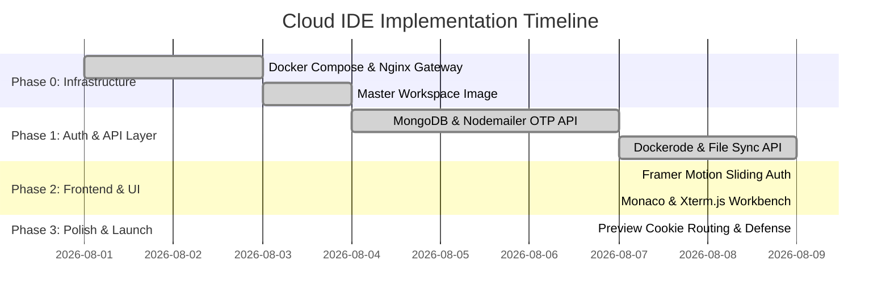
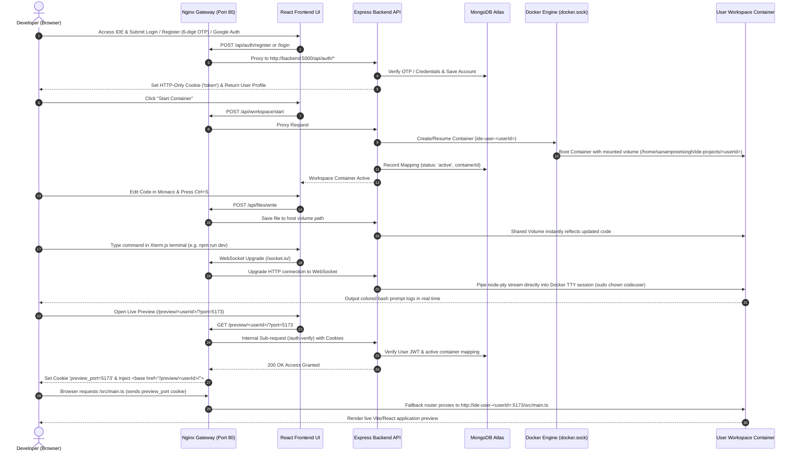

# 🚀 Cloud IDE Capstone: Project Status & Architectural Report

> **Project Name:** Cloud IDE (Terminal-Based Cloud Workspace)  
> **Target Audience:** Capstone Defense & Technical Reviewers  
> **Status:** 100% Completed & Deployed  
> **Last Updated:** August 9, 2026  

---

## 🎯 1. Executive Summary & Core Objectives

The **Cloud IDE** is a multi-tenant, cloud-based Integrated Development Environment (IDE) that provides developers with isolated Linux containers in the cloud. It features real-time code editing with Monaco Editor, interactive terminal access over WebSockets via Xterm.js, file management synced directly to persistent host storage, and zero-config dynamic web previews.

### Key Capstone Architectural Highlights
1. **Multi-Tenancy & Container Isolation:**  
   Every user operates inside a dedicated, resource-capped Docker container (`ide-workspace:latest` with non-root `codeuser`, C++/Node.js toolchains, and `tini` process supervision) spawned dynamically via Dockerode.
2. **Zero-Config Dynamic Web Previews:**  
   Nginx reverse proxy uses regex-based routing (`/preview/<user_id>/`) combined with cookie-based port persistence (`preview_port=5173`) and internal `/auth-verify` sub-requests to proxy user web applications (Vite/React/Express) running on any port inside their container directly to the browser with `<base>` tag injection, sub_filter URL rewrites, and MIME header preservation.
3. **Real-Time Terminal & Workspace File Sync:**  
   `xterm.js` in the frontend communicates over WebSockets (`Socket.io`) connected to `node-pty` / Docker execution streams inside the backend, while host-mounted volumes (`/home/sanampreetsingh/ide-projects/<userId>`) keep user files persistent and synchronized with Monaco Editor.
4. **Interactive Sliding Auth System:**  
   Framer Motion spring sliding panels for Login, Register (with 6-digit Nodemailer OTP verification), Forgot Password (OTP verification), and Google OAuth JWT session management.

---

## 📁 2. Complete Repository File Structure

```text
Online-IDE-Terminal-Based-IDE-/
├── .env                        # Global environment variables (Ports, JWT Secret, Mongo URI, Mail Credentials)
├── .gitignore                  # Git ignore rules
├── compose.yml                 # Orchestrates Gateway (Nginx) and Backend (Manager)
├── setup.sh                    # Single-command automation script for network setup, dist compilation & container launch
├── README.md                   # Complete GitHub project documentation
├── report.md                   # Comprehensive capstone architectural report
│
├── infra/                      # Reverse Proxy Infrastructure
│   └── nginx.conf              # Nginx gateway with Zero-Config Preview, Cookie Port Persistence & WebSocket rules
│
├── workspace/                  # Blueprint for User Workspaces
│   └── Dockerfile              # Custom Debian image with C++, Node.js 22, tini, serve-link & PS1 prompt
│
├── backend/                    # Node.js + Express API & Container Manager
│   ├── Dockerfile              # Express API container definition (mounts docker.sock)
│   ├── package.json            # Backend dependencies (express, mongoose, dockerode, socket.io, bcryptjs, nodemailer)
│   ├── server.js               # Express entrypoint, WebSocket upgrade server & SIGTERM cleanup
│   ├── config/
│   │   ├── env.config.js       # Fail-fast environment variable validator
│   │   └── db.config.js        # Mongoose MongoDB connection initializer
│   ├── models/
│   │   ├── user.model.js       # User schema with Google ID, password, & explicit indexing (_id, email)
│   │   ├── otp.model.js        # TTL-based OTP schema with 5-minute auto-expiry & compound index
│   │   └── map.model.js        # User-to-Container mapping schema with lastActive tracking
│   ├── controllers/
│   │   ├── auth.controller.js      # Google Auth, login, sendOtp, register, forgotPassword, verifyPreview
│   │   ├── workspace.controller.js # startWorkspace, stopWorkspace, getWorkspaceStatus
│   │   └── file.controller.js      # getFileTree, readFile, writeFile, createEntry, deleteEntry, renameEntry
│   ├── routes/
│   │   ├── auth.routes.js      # Routes under /api/auth/*
│   │   ├── workspace.routes.js # Routes under /api/workspace/*
│   │   └── file.routes.js      # Routes under /api/files/*
│   ├── middlewares/
│   │   ├── requireAuth.js      # JWT validator from Cookie or Authorization Header
│   │   └── errorHandler.js     # Centralized global Express error handler
│   ├── services/
│   │   ├── docker.service.js   # Dockerode API wrapper to spawn, inspect, stop & resume user containers
│   │   ├── socket.service.js   # PTY streaming to container TTY with auto chown volume permissions
│   │   ├── file.service.js     # Host volume file manipulation with path traversal security guards
│   │   ├── cleanup.service.js  # Automated cron service cleaning idle user containers after 30 mins
│   │   └── email.service.js    # Nodemailer HTML OTP email dispatcher
│   └── utils/
│       ├── jwt.util.js         # JWT signing & verification helper
│       └── catchAsync.js       # Async wrapper eliminating boilerplate try/catch
│
└── frontend/                   # React + Vite + Redux Toolkit UI
    ├── package.json            # UI dependencies (React, Redux Toolkit, Monaco, Xterm.js, Framer Motion, Sonner)
    ├── vite.config.js          # Vite build configuration
    ├── index.html              # HTML entrypoint
    └── src/
        ├── App.jsx             # React Router with AuthPage & IDEWorkspace routes and ProtectedRoute guards
        ├── main.jsx            # Redux Provider, UserProvider, GoogleOAuthProvider & Sonner Toaster wrapper
        ├── index.css           # Global CSS resets & custom sleek scrollbar styling
        ├── api/
        │   ├── axiosInstance.js# Axios client configured with withCredentials: true
        │   ├── authApi.js      # Auth API endpoints (login, register, sendOtp, forgotPassword, googleLogin)
        │   ├── workspaceApi.js # Workspace lifecycle API methods
        │   └── fileApi.js      # Host file system API methods
        ├── store/
        │   ├── index.js        # Redux Toolkit store configuration
        │   └── slices/
        │       ├── authSlice.js      # User authentication session slice
        │       ├── workspaceSlice.js # Container lifecycle state slice
        │       └── fileSlice.js      # Editor tabs and file tree slice
        ├── components/
        │   ├── auth/
        │   │   ├── SlidingPanel.jsx       # Framer Motion brand sliding panel
        │   │   ├── LoginForm.jsx          # Email/Password + Google OAuth login form
        │   │   ├── RegisterForm.jsx       # Name + Email + 6-Digit OTP verification + Password form
        │   │   └── ForgotPasswordForm.jsx # Password reset form with 6-digit OTP
        │   ├── sidebar/
        │   │   └── FileExplorer.jsx       # Tree explorer with file/folder creation, rename, & deletion
        │   ├── editor/
        │   │   ├── TabBar.jsx             # Open file tab bar with dirty indicators
        │   │   └── MonacoEditorContainer.jsx # Monaco VS-Dark editor with syntax highlighting & Ctrl+S
        │   ├── preview/
        │   │   └── LivePreviewBar.jsx     # URL converter, inline iframe preview drawer & new tab launcher
        │   └── Terminal.jsx               # Xterm.js terminal with auto-reconnection & connection status
        └── pages/
            └── AuthPage.jsx               # Dual sliding authentication page with Framer Motion spring transforms
```

---

## ⏳ 3. Project Roadmap, Phases & Timeline Status



### Phase Completion Table

| Phase | Description | Status | Components Developed |
| :--- | :--- | :---: | :--- |
| **Phase 0** | **Core Infrastructure Setup** | ✅ Completed | `compose.yml`, `setup.sh`, `infra/nginx.conf`, `workspace/Dockerfile` |
| **Phase 1** | **Backend Auth & Email OTP** | ✅ Completed | `env.config.js`, `user.model.js`, `otp.model.js`, `email.service.js`, `auth.controller.js` (Google OAuth, 6-digit OTP, Register, Forgot Password) |
| **Phase 2** | **Docker Container Orchestration** | ✅ Completed | `docker.service.js`, `map.model.js`, `workspace.controller.js`, `cleanup.service.js`, Auto permission chown |
| **Phase 3** | **File Sync & Storage Services** | ✅ Completed | `file.service.js`, `file.controller.js`, `file.routes.js`, Host volume security bounds |
| **Phase 4** | **Frontend UI & State Engine** | ✅ Completed | Framer Motion sliding Auth, Redux Toolkit Slices, `FileExplorer.jsx`, `MonacoEditorContainer.jsx`, `Terminal.jsx`, `LivePreviewBar.jsx` |
| **Phase 5** | **Dynamic Preview & Defense** | ✅ Completed | Nginx Cookie Port Persistence (`preview_port`), Dev server fallback router (`/src`, `/node_modules`, `/@vite`), Custom 502 error banner |

---

## 🛠️ 4. Backend APIs Developed & Mechanics

All backend routes are mounted under `/api` and reverse-proxied via Nginx.

### A. Authentication Endpoints (`/api/auth`)

| Endpoint | Method | Auth Required | Request Body | Description & Mechanics |
| :--- | :---: | :---: | :--- | :--- |
| `/api/auth/google` | `POST` | ❌ No | `{ token }` | Verifies Google ID token, upserts User record, signs JWT, sets HTTP-only `token` cookie. |
| `/api/auth/login` | `POST` | ❌ No | `{ email, password }` | Authenticates email & password via `bcryptjs`, signs JWT, sets HTTP-only `token` cookie. |
| `/api/auth/send-otp` | `POST` | ❌ No | `{ email, type }` | Validates user existence (must exist for `forgot`, must NOT exist for `register`), generates 6-digit OTP, saves in `Otp` model with 5-min TTL, emails code via Nodemailer. |
| `/api/auth/register` | `POST` | ❌ No | `{ name, email, password, otp }` | Verifies 6-digit OTP, deletes OTP, hashes password with `bcryptjs`, creates `User`, sets JWT cookie. |
| `/api/auth/forgot-password` | `POST` | ❌ No | `{ email, otp, newPassword }` | Verifies OTP for `forgot`, deletes OTP, hashes `newPassword`, updates `User` password. |
| `/api/auth/verify-preview` | `GET` | 🔒 Internal | Header: `X-Target-User` | Used internally by Nginx `auth_request`. Validates JWT cookie and verifies container active status in `Map` collection. |
| `/api/auth/me` | `GET` | 🔐 Yes | None | Returns current logged-in user profile (`req.user`). |
| `/api/auth/logout` | `POST` | ❌ No | None | Clears `token` HTTP-only cookie. |

### B. Workspace Management Endpoints (`/api/workspace`)

| Endpoint | Method | Auth Required | Description & Mechanics |
| :--- | :---: | :---: | :--- |
| `/api/workspace/start` | `POST` | 🔐 Yes | Spawns/resumes user Docker container (`ide-user-<userId>`), creates host volume `/home/sanampreetsingh/ide-projects/<userId>`, updates `Map` database status to `active`. |
| `/api/workspace/stop` | `POST` | 🔐 Yes | Stops running user container via Dockerode, marks container status as `stopped` in `Map`. |
| `/api/workspace/status` | `GET` | 🔐 Yes | Returns current container status (`active`, `stopped`, `inactive`) and container mapping metadata. |

### C. Workspace File Operations Endpoints (`/api/files`)

| Endpoint | Method | Auth Required | Parameters / Body | Description & Mechanics |
| :--- | :---: | :---: | :--- | :--- |
| `/api/files/tree` | `GET` | 🔐 Yes | None | Recursively scans user workspace host directory and returns complete file/folder tree object. |
| `/api/files/read` | `GET` | 🔐 Yes | Query: `?path=src/App.js` | Reads UTF-8 file contents from target host path. |
| `/api/files/write` | `POST` | 🔐 Yes | Body: `{ path, content }` | Writes UTF-8 text to target file path. Auto-creates parent directories. |
| `/api/files/create` | `POST` | 🔐 Yes | Body: `{ path, type }` | Creates empty file or directory (`type: 'file' \| 'directory'`). |
| `/api/files/delete` | `DELETE` | 🔐 Yes | Query/Body: `{ path }` | Deletes file or directory recursively. |
| `/api/files/rename` | `PUT` | 🔐 Yes | Body: `{ oldPath, newPath }` | Moves/renames file or folder within user workspace. |

---

## 🔄 5. End-to-End System User Flow Model



---

## 🛡️ 6. Technical Security & Capstone Presentation Highlights

1. **Host Traversal Guard:**  
   `file.service.js` enforces strict path bounds checks to prevent users from accessing files outside `/home/sanampreetsingh/ide-projects/<userId>`.
2. **Container Sandbox & Resource Limits:**  
   Docker containers are capped at **512MB RAM** and **0.5 CPU**, preventing CPU mining or memory exhaustion attacks.
3. **Cookie Port & User Persistence:**  
   Nginx sets `preview_user` and `preview_port` cookies on `Path=/` during preview initialization, allowing sub-resource requests (`/src/*`, `/node_modules/*`, `/@vite/*`) to automatically route to the correct user container port without MIME type corruption.
4. **Auto Terminal Reconnection & Permission Sync:**  
   Terminal WebSocket automatically reconnects when containers transition to `active`, and PTY initialization issues `sudo chown -R codeuser:codeuser /home/codeuser/workspace` to prevent `EACCES` permission errors during `npm create vite` commands.
